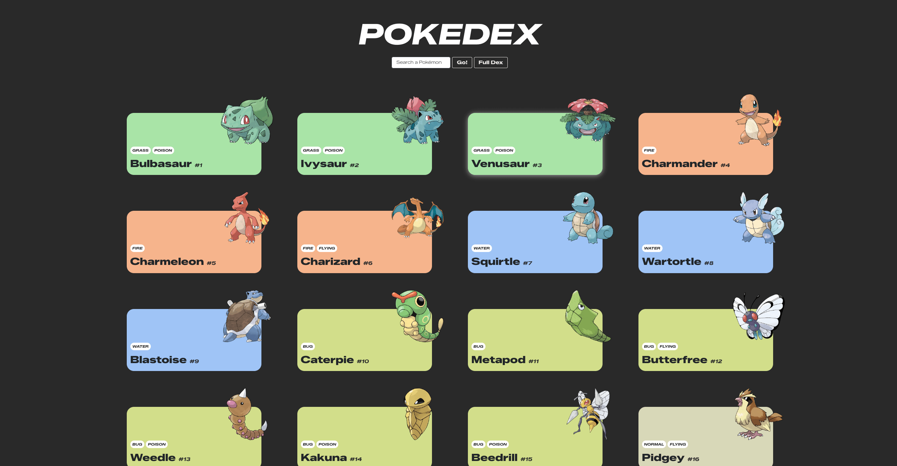
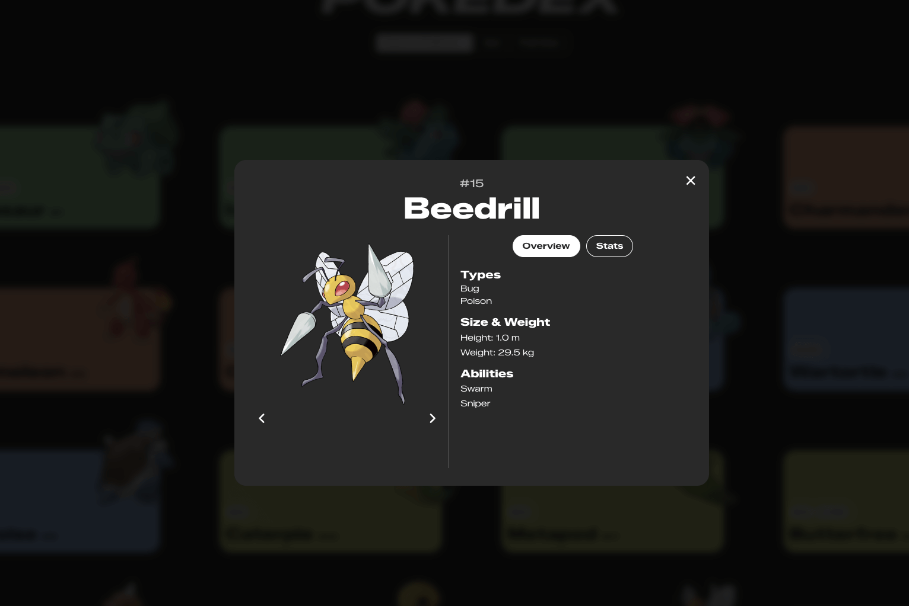

# DEVELOPER AKADEMIE – POKEDEX

## Overview

Pokedex is an interactive Pokémon encyclopedia built with **HTML, CSS, and Vanilla JavaScript**. Users can **browse, search, and explore Pokémon**, view their stats, types, abilities, and navigate through a **responsive, mobile-first interface**. The project fetches live data from the **PokéAPI** and dynamically renders Pokémon cards and a modal with detailed information.

### The Challenge

- Dynamically fetch and display Pokémon from the **PokéAPI**
- Implement search functionality for Pokémon by name or ID
- Display Pokémon details (types, abilities, stats, size/weight) in a modal
- Implement **load more** functionality to progressively show Pokémon
- Create a **responsive and visually appealing** layout
- Use **vanilla JavaScript, CSS variables, and modular code** for maintainability

### Links

- **Solution URL:** [GitHub Repository](https://github.com/stefanstraeter/pokedex)
- **Live Site URL:** [Live Demo](https://stefanstraeter.github.io/pokedex/)

### Screenshot

---

## My Process

### Built With

- **HTML5** – semantic markup for structure
- **CSS3** – Grid, Flexbox, CSS variables, responsive layout
- **JavaScript (Vanilla)** – dynamic rendering, fetch API, modal interactions
- **Mobile-First Workflow** – interface adapts seamlessly to all screen sizes
- **Bootstrap 5** – base styles and responsive utilities
- **Font Awesome** – icons for navigation and UI elements

### Key Features & Techniques

#### Dynamic Pokémon Rendering

- Pokémon cards are dynamically created from **API data**
- `fetchPokemon()` retrieves basic data, `fetchPokemonFullDetails()` fetches detailed stats
- `pokemonCardHtml()` and `pokemonModalHtml()` generate dynamic HTML for cards and modals

#### Search & Reset

- Users can search Pokémon by **name or ID**
- Reset button restores the full Pokémon list
- `searchPokemon()` and `loadPokemonBatch()` handle dynamic content updates

#### Modal Details

- Clicking a Pokémon card opens a **modal with detailed information**
- Modal displays:
  - **Types**
  - **Abilities**
  - **Stats**
  - **Height & Weight**
- Navigation buttons allow browsing the **previous and next Pokémon**

#### Responsive Design & Mobile-First Approach

- Grid layout adapts from **1 to 4 columns** depending on screen size
- Modal layout adjusts for smaller screens
- Smooth animations and hover effects enhance UX

#### Modular & Maintainable Code

- **Separate JS modules** for API, templates, modal functionality
- CSS organized by **variables, components, layout, modal**
- Centralized fonts and color variables in `variables.css`

---

## Author

- GitHub: [@stefanstraeter](https://github.com/stefanstraeter/)

# pokedex
